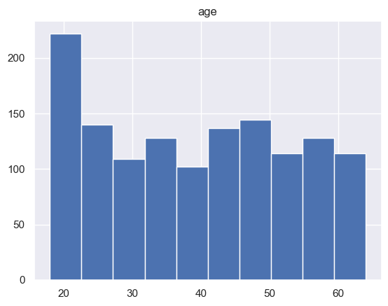
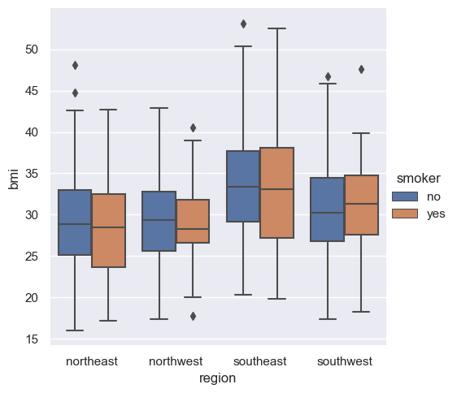
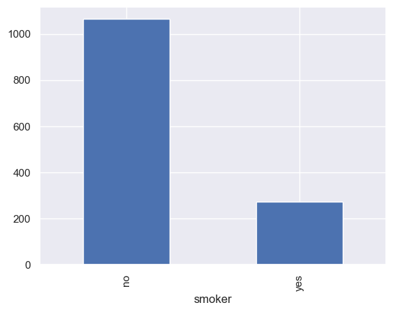
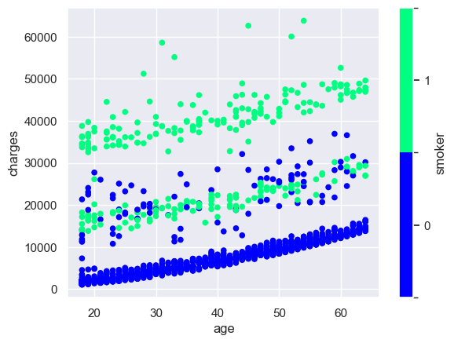
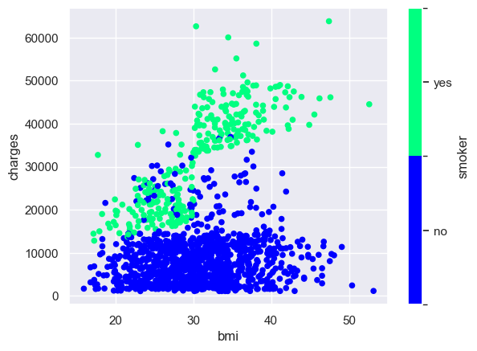
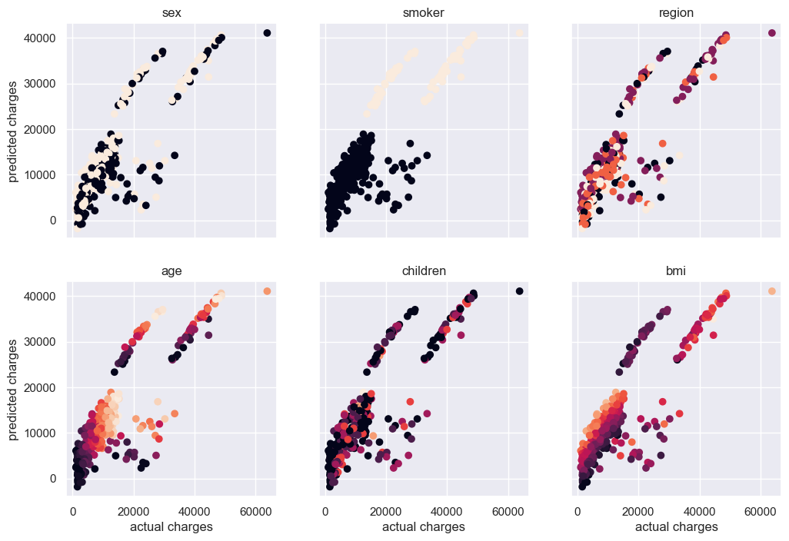
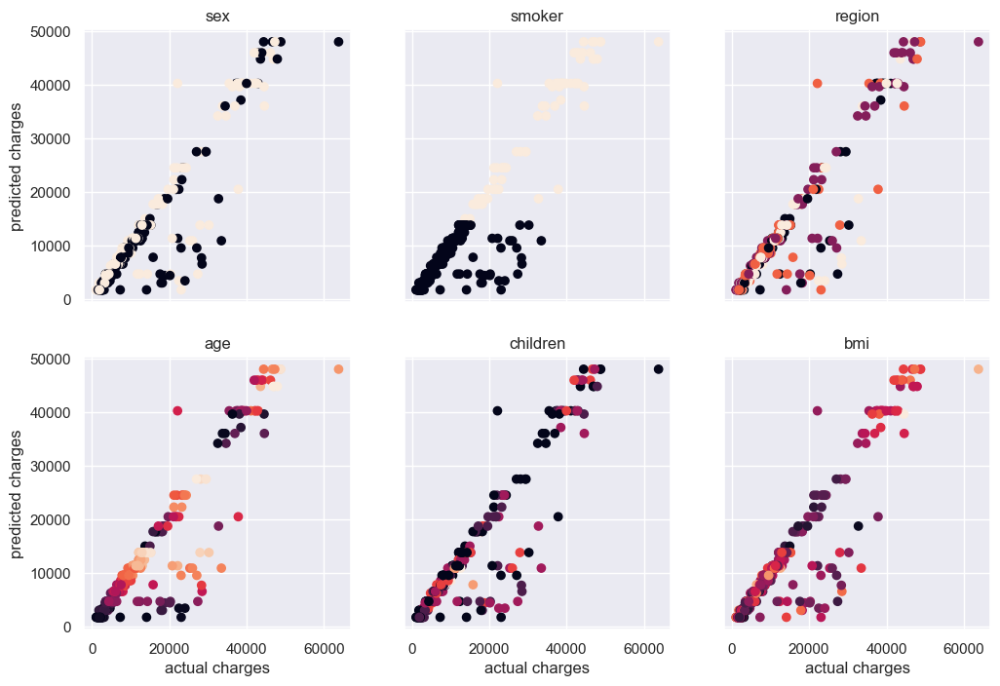
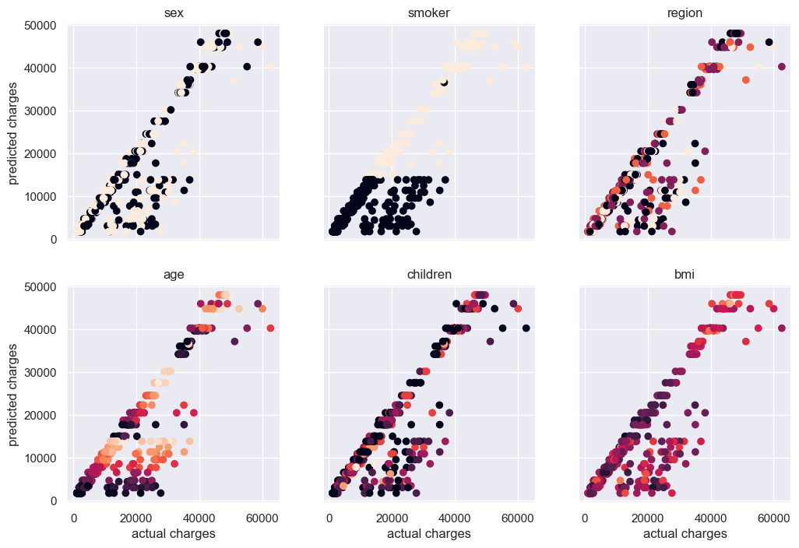

# us-medical-insurance-costs
Jupyter Notebook for predicting medical insurance charges based on demographic data.

Dataset can be downloaded from GitHub [https://github.com/stedy/Machine-Learning-with-R-datasets](https://github.com/stedy/Machine-Learning-with-R-datasets).

## Exploratory data analysis revealed several potential sources of bias in the dataset:

There is an over-representation of the youngest age bracket in the dataset:

The average bmi is greater for the southeast region than for the other 3 regions represented in the dataset:

Smokers are under-represented in the dataset:

## Additional Observations from EDA:

Plotting the medical charges vs age, and colored by smoking status revealed that there are several distinct trends in the data.  There are separate trends for smokers and non-smokers, and a third trend which is comprised of both smokers and non-smokers:

Plotting medical charges by BMI, and colored by smoking status revealed that BMI is not a strong driver of medical costs for non-smokers, but has a strong relationship to costs for smokers:

## Prediction Models

Given the observations made during the EDA, it is clear that there is a non-linear component to the medical cost prediction, due to the dependencies on smoking status, BMI, and age.  To verify, I first tried a simple linear regression. As expected, the linear regression did a poor job in predicting medical costs, and was unable to handle the differences between smokers and non-smokers.  In the series of 6 plots below, the predicted vs actual costs are crossplotted, and each plot is colored by one of the 6 available features in the dataset:

Given the observation of non-linear behavior, I next tried a series of decision-tree methods (Random Forest and XGBoost).  Both of these methods worked quite well and handling both smokers and non-smokers.  Ultimately, I decided to use a simple decision tree regression. Random Forest and XGBoost are ensemble methods, meaning that an ensemble of decision trees are created, and then the final answer is derived from an average of these tree's results.  However, for the purpose of calculating health insurance costs, there is value in having a single tree which can be used to audit an individual's predicted premiums, thus lending transparency to the process. Below are the predicted vs actual costs for the validation data and training data:

, "Predicted vs actual charges for decision tree on validation data")

, "Predicted vs actual charges for decision tree on training data")

The decision tree methods did a good job of accurately predicting costs for the majority of the dataset, however there is a subset of the data which is not well described by the model (costs are under-predicted for this sub-population). Coloring the data by each of the available features does not reveal any particular pattern to this sub-population, suggesting that there is another factor at play which is not one of the features captured in this dataset. This is likely the third trend observed in the "Charges vs. Age by Smoking Status" plot observed in the EDA, and is composed of both smokers and non-smokers.

A particular advantage of the decision tree methods is the ability to see the decision tree which was created in order to see which factors are most impactful:

For this example, I used a tree that was 5 layers deep, however one could opt for a simpler tree at the sacrifice of some accuracy (bias / variance tradeoff).

